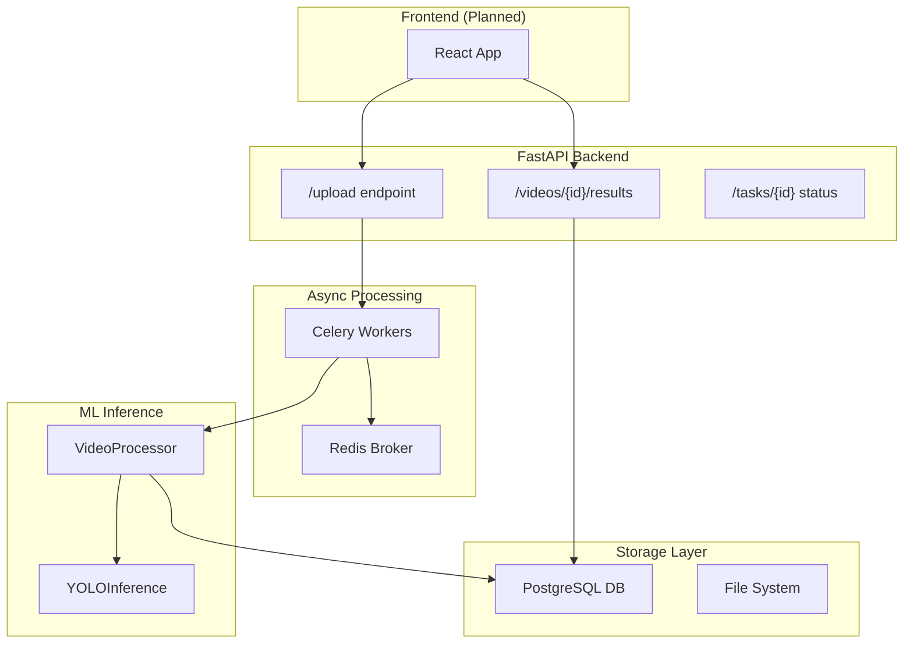

# Project Assessment: ProjectXII Computer Vision - Brand Logo Detection

## 📋 Executive Summary

This is a **well-structured computer vision project** aimed at detecting and measuring brand logo exposure time in videos. The team has built a functional end-to-end pipeline from video upload to detection analysis, with trained YOLO models achieving strong metrics.

| Aspect | Rating | Notes |
|--------|--------|-------|
| **Architecture** | ⭐⭐⭐⭐ | Clean separation of concerns, modular design |
| **Model Performance** | ⭐⭐⭐⭐⭐ | Excellent metrics (mAP50: 0.959 with YOLO11x) |
| **Code Quality** | ⭐⭐⭐⭐ | Well-documented, follows best practices |
| **Production Readiness** | ⭐⭐⭐ | Good foundation, some gaps remain |
| **Documentation** | ⭐⭐⭐ | Decent READMEs but missing unified docs |

---

## 🏗️ Project Architecture



### Key Components

| Component | File | Purpose |
|-----------|------|---------|
| **API Server** | [main.py](file:///c:/Users/Coder/OneDrive/Desktop/F5/ProjectXII_ComputerVision_G3/src/api/main.py) | FastAPI application with video upload, results retrieval |
| **YOLO Wrapper** | [yolo_inference.py](file:///c:/Users/Coder/OneDrive/Desktop/F5/ProjectXII_ComputerVision_G3/src/model_inference/yolo_inference.py) | Model loading, inference, output normalization |
| **Video Processor** | [video_processor.py](file:///c:/Users/Coder/OneDrive/Desktop/F5/ProjectXII_ComputerVision_G3/src/video_processor/video_processor.py) | Frame extraction, batch processing, statistics |
| **Celery Tasks** | [tasks.py](file:///c:/Users/Coder/OneDrive/Desktop/F5/ProjectXII_ComputerVision_G3/src/services/tasks.py) | Async video processing with progress tracking |
| **Database Models** | [models.py](file:///c:/Users/Coder/OneDrive/Desktop/F5/ProjectXII_ComputerVision_G3/src/database/models.py) | Video, Brand, Detection, VideoBrandStats ORM |
| **Repository** | [repository.py](file:///c:/Users/Coder/OneDrive/Desktop/F5/ProjectXII_ComputerVision_G3/src/database/repository.py) | Data access layer with query methods |

---

## 🤖 Model Training & Performance

### Dataset Information

| Metric | Value |
|--------|-------|
| **Total Images** | 3,304 |
| **Train/Valid/Test Split** | 2,232 / 402 / 670 |
| **Number of Classes** | 175 brand logos |
| **Source** | [Roboflow Dataset](https://universe.roboflow.com/sekant/my-first-project-4wl7u/dataset/1) |

#### Top 5 Most Frequent Brands
1. Outlook (195 images)
2. PayPal (155 images)
3. Chase Personal Banking (100 images)
4. Bank of America (93 images)
5. Facebook (56 images)

### Trained Models Comparison

| Model | mAP50 | mAP50-95 | Precision | Recall | FPS | Use Case |
|-------|-------|----------|-----------|--------|-----|----------|
| **YOLOv8x** | 0.927 | 0.900 | 0.885 | 0.846 | 18 | Production (balanced) |
| **YOLO11x** | 0.959 | 0.927 | 0.906 | 0.921 | 13 | Maximum accuracy |

> [!TIP]
> **YOLOv8x** is recommended for production due to better speed-accuracy tradeoff. Use **YOLO11x** for batch processing where accuracy is paramount.

### Training Notebooks

| Notebook | Model | Platform |
|----------|-------|----------|
| [Training_YOLO11x_K.ipynb](file:///c:/Users/Coder/OneDrive/Desktop/F5/ProjectXII_ComputerVision_G3/notebooks/Training_YOLO11x_K.ipynb) | YOLO11x | Colab/Local |
| [Training_YOLO_K.ipynb](file:///c:/Users/Coder/OneDrive/Desktop/F5/ProjectXII_ComputerVision_G3/notebooks/Training_YOLO_K.ipynb) | YOLOv8x | Colab/Local |
| [yolo-training_yolo8n.ipynb](file:///c:/Users/Coder/OneDrive/Desktop/F5/ProjectXII_ComputerVision_G3/notebooks/yolo-training_yolo8n.ipynb) | YOLOv8n | Baseline |

---

## ✅ Strengths

### 1. **Clean Modular Architecture**
- Clear separation between API, model inference, video processing, and database layers
- Well-defined interfaces between components
- Context managers for resource cleanup

### 2. **Robust Async Processing**
```python
# Model caching per Celery worker - excellent optimization
@worker_process_init.connect
def init_worker_process(**kwargs):
    global _model_cache
    _model_cache = YOLOInference(...)
```

### 3. **Comprehensive Database Schema**
- Pre-computed `VideoBrandStats` table for efficient analytics queries
- Proper indexing on common query patterns
- Cascade deletes configured correctly

### 4. **Strong Model Performance**
- mAP50 of 0.959 with YOLO11x is excellent for 175 classes
- Both PyTorch and ONNX export paths ready

### 5. **Docker + GPU Support**
- NVIDIA CUDA base image for GPU inference
- Proper volume mounting for dataset and code

---

## ⚠️ Areas for Improvement

### 1. **Incomplete API-Database Integration**

```python
# In main.py - Video model not imported!
# from src.database.models import Video, Detection, Brand, AnalysisSession
```

The API endpoints reference `Video`, `Brand`, `Detection` but the import is commented out, meaning `/videos` and `/videos/{id}/results` endpoints will crash.

### 2. **Missing Test Suite**
No unit tests or integration tests found. Critical for a production system.

### 3. **Docker Compose Incomplete**
```yaml
# Current docker-compose.yml is minimal
services:
  app:
    build: .
    runtime: nvidia
```

**Missing:**
- PostgreSQL service
- Redis service (needed for Celery)
- Celery worker service
- Volume persistence for database

### 4. **Class Imbalance in Dataset**
- Top brand (Outlook) has 195 images
- Many brands likely have < 10 images
- May cause poor detection for rare logos

### 5. **No Model Versioning/MLOps**
- Models stored in Google Drive (not ideal)
- No experiment tracking (MLflow, W&B)
- No automated retraining pipeline

### 6. **API Security**
- No authentication/authorization
- No rate limiting
- CORS allows all headers/methods

---

## 🔧 Recommendations

### High Priority

1. **Fix API Database Integration**
   - Uncomment the model imports in `main.py`
   - Complete the integration testing

2. **Complete Docker Compose**
   ```yaml
   services:
     api:
       build: .
       ports: ["8000:8000"]
       depends_on: [db, redis]
     
     celery:
       build: .
       command: celery -A src.celeryconfig worker
       depends_on: [redis]
     
     db:
       image: postgres:15
       volumes: [db-data:/var/lib/postgresql/data]
     
     redis:
       image: redis:7-alpine
   ```

3. **Add Test Framework**
   - pytest + pytest-asyncio for API tests
   - Test video processing pipeline end-to-end

### Medium Priority

4. **Address Class Imbalance**
   - Apply data augmentation for underrepresented classes
   - Consider focal loss or class weights during training
   - Collect more samples for rare brands

5. **Add Model Registry**
   - Store models in S3/GCS with versioning
   - Track experiments with MLflow or Weights & Biases

6. **Improve Video Processing**
   - Add support for streaming/chunked video upload
   - Consider GPU-accelerated frame extraction (NVIDIA DALI)

### Lower Priority

7. **API Security Hardening**
   - Add JWT authentication
   - Implement rate limiting
   - Restrict CORS origins

8. **Frontend Integration**
   - The API is ready for a React frontend
   - Consider adding WebSocket for real-time progress updates

---

## 📊 Technical Debt Summary

| Issue | Severity | Effort | Impact |
|-------|----------|--------|--------|
| Commented model imports | 🔴 High | Low | API crashes |
| Missing Docker services | 🔴 High | Medium | Can't deploy |
| No tests | 🟡 Medium | High | Risk of regressions |
| Class imbalance | 🟡 Medium | High | Poor rare brand detection |
| No model registry | 🟢 Low | Medium | Manual model management |
| No auth | 🟢 Low | Medium | Security risk |

---

## 💡 Quick Wins

1. **Uncomment the database imports in `main.py`** - 5 minutes
2. **Add a basic Dockerfile health check** - 10 minutes
3. **Create a `docker-compose.full.yml`** with all services - 30 minutes
4. **Add a `/health` endpoint** that checks DB connectivity - 15 minutes

---

## 🎯 Conclusion

This is a **solid foundation** for a brand logo detection system. The team has made excellent progress with:
- Working YOLO models with strong metrics
- Clean, well-documented code architecture
- Async processing pipeline design

**Before production deployment**, focus on:
1. Fixing the API-database integration
2. Completing Docker orchestration
3. Adding a test suite
4. Addressing dataset class imbalance

The project is approximately **70% ready for production** and could be deployable within 1-2 sprints of focused work.
